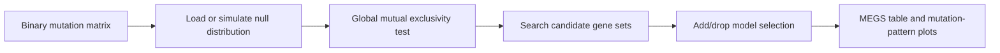
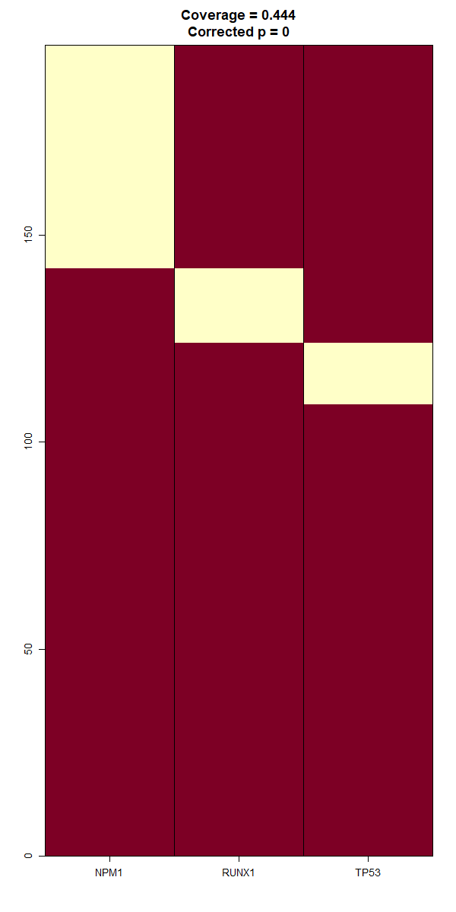
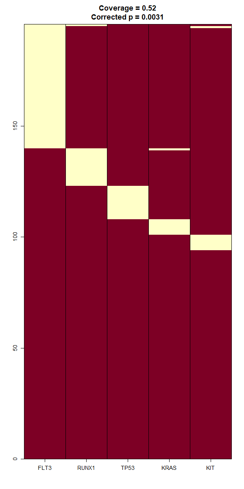

# MEGSA

[](https://github.com/xhua84/MEGSA/actions/workflows/R-CMD-check.yaml)

MEGSA is a framework for analyzing mutual exclusivity of tumor mutations. It was originally developed to identify mutually exclusive gene sets using a likelihood ratio test and model selection procedure, with support for de novo discovery, pathway-guided searches, and expansion of established gene sets.

This repository contains the formal R package version of MEGSA. The original public release was distributed as R scripts and example data through the National Cancer Institute Division of Cancer Epidemiology and Genetics (DCEG) website. The goal of this repository is to modernize that code into an installable, documented, tested R package.

## Development Status

The R package is under active development. The current package includes documented functions, regression tests based on the original LAML example data, optional parallel simulation support, a vignette, and a generated reference-manual workflow.

## Installation

```r
install.packages("devtools")
devtools::install_github("xhua84/MEGSA")
```

## Quick Start

```r
library(MEGSA)

mutation_file <- system.file("extdata", "mutationMat_LAML.txt", package = "MEGSA")
max_simu_file <- system.file("extdata", "maxSSimu_LAML.txt", package = "MEGSA")

mutation_mat <- read_megsa_mutation_matrix(mutation_file)
max_simu <- read_megsa_max_simu(max_simu_file)

result <- megsa(mutation_mat, maxSSimu = max_simu, maxSize = 6)
result
as.data.frame(result)
```

## Pipeline / Workflow

MEGSA follows the framework described in the reference paper. The paper figures
provide the original visual context:

- Figure 1: mutation matrix input, likelihood model, global null test, and model
  selection logic.
- Figure 2: three analysis strategies: de novo discovery, pathway-guided
  searches, and expansion of established gene sets.
- Figure 5: TCGA LAML application results, corresponding to the bundled LAML
  example data distributed with this package.

See the published article for these figures:
https://doi.org/10.1016/j.ajhg.2015.12.021



Using the bundled LAML example data, MEGSA identifies the following top gene-set
results:

| Gene set | Coverage | LRT | Nominal p | Corrected p |
| --- | ---: | ---: | ---: | ---: |
| NPM1 RUNX1 TP53 | 0.444 | 25.089 | 2.74e-07 | 0.0000 |
| FLT3 KRAS RUNX1 KIT TP53 | 0.520 | 27.961 | 6.19e-08 | 0.0031 |
| FLT3 TP53 RUNX1 | 0.449 | 19.882 | 4.12e-06 | 0.0046 |
| FLT3 KRAS RUNX1 TP53 | 0.485 | 23.328 | 6.83e-07 | 0.0070 |
| FLT3 TP53 IDH2 KIT NRAS | 0.551 | 25.605 | 2.09e-07 | 0.0099 |

Example mutation-pattern plots generated by `funPlotMEGS()`:

<p>
  
  
</p>

## Parallel Simulation

```r
max_simu <- funMaxSSimu(
  mutation_mat,
  nSimu = 100,
  nPairStart = 10,
  maxSize = 6,
  ncores = 2,
  seed = 1,
  detail = FALSE
)
```

## Documentation

The package vignette provides a practical user guide:

```r
vignette("MEGSA", package = "MEGSA")
```

When installing from GitHub, build vignettes explicitly if you want them
available through `vignette()`:

```r
devtools::install_github("xhua84/MEGSA", build_vignettes = TRUE)
```

The function reference manual is generated from the package documentation:

```sh
Rscript --vanilla tools/build_reference_manual.R
```

This writes `MEGSA-reference-manual.pdf` in the package root.

## Original Software

The original MEGSA source-code bundle is available from the DCEG tool page:

https://dceg.cancer.gov/tools/analysis/megsa

## Reference

Hua X, Hyland PL, Huang J, Song L, Zhu B, Caporaso NE, Landi MT, Chatterjee N, Shi J. 2016. MEGSA: A powerful and flexible framework for analyzing mutual exclusivity of tumor mutations. *The American Journal of Human Genetics* 98(3):442-455. https://doi.org/10.1016/j.ajhg.2015.12.021
